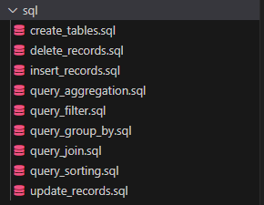

# datafun-05-sql
Project 5 integrates Python and SQL, focusing on database interactions using SQLite.

Created by: Nolan Moss

### Project setup

1. Create virtual environment
- py -m venv .venv
2. Activate environment
- .\.venv\Scripts\Activate
3. Install requirements
- py -m pip install pandas pyarrow pathlib logging

4. Freeze requirements
- py -m pip freeze > requirements.txt

### Functionality
The script performs the following operations:

- Create Database: Creates an SQLite database file named project.db in the root project directory if it doesn't exist.
- Create Tables: Executes SQL statements to create tables based on the schema defined.
- Insert Data from CSV: Reads data from CSV files (data/authors.csv and data/books.csv) and inserts the records into their respective tables in the database.
- Execute SQL from File: Executes SQL commands stored in separate SQL files located in the sql/ directory.
- Main Function: Executes the main functionality of the script, including creating the database, tables, inserting data, and executing SQL commands.

### SQL Operations

The script performs the following SQL operations:

- Create Tables: Defines the structure of tables in the database.
- Insert Records: Inserts data into tables from CSV files.
- Update Records: Modifies existing records in the tables.
- Delete Records: Removes records from the tables.
- Query Aggregation: Performs aggregate functions (e.g., SUM, AVG) on the data.
- Query Filtering: Retrieves specific records based on specified conditions.
- Query Sorting: Orders the retrieved records based on specified criteria.
- Query Grouping: Groups records based on specified attributes.
- Query Joining: Combines data from multiple tables based on specified relationships.